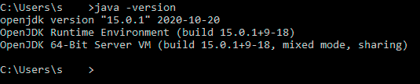

 

# Java ficbook.net Parser

## Что и как работает

Программа сохраняет главу в `txt` файл с названием книги на рабочий стол.  
Программа поддерживает различные ссылки:
1. https://ficbook.net/readfic/9975473/25667941#part_content
2. https://ficbook.net/readfic/9975473/25667941
3. и т.д

## Запуск программы

Двойным нажатием по .jar файлу. Если ничего не произошло, тогда нужно установить **только** JDK и настроить [PATH](https://javatutorial.net/set-java-home-windows-10) при необходимости!
Еще нужно установить **Python**!

Так выглядит правильная установка:

## FAQ & Troubleshooting

• На Windows/MacOS/Linux установите [Oracle Java](https://www.oracle.com/java/technologies/javase-downloads.html) или [OpenJDK](https://adoptopenjdk.net/).  
• На Windows/MacOS/Linux установите [Python 3.9+](https://www.python.org/downloads/).   

P. S. Если Вы используете `OpenJDK` и у Вас не открывается программа по двойному клику. Вам нужно скачать и запустить сначало это: [Jarfix 3.0.0](https://www.heise.de/download/product/jarfix-41657/download)

Если ничего не помогло или нашли баг свяжитесь со мной через почту: `contact@megoru.ru`

## LICENSE
#### [CC BY-NC-SA 4.0](https://github.com/megoRU/ficbook.net_Parser/blob/master/LICENSE)

## Copyright Notice

1.  This program uses the library: [cloudscraper](https://github.com/VeNoMouS/cloudscraper)